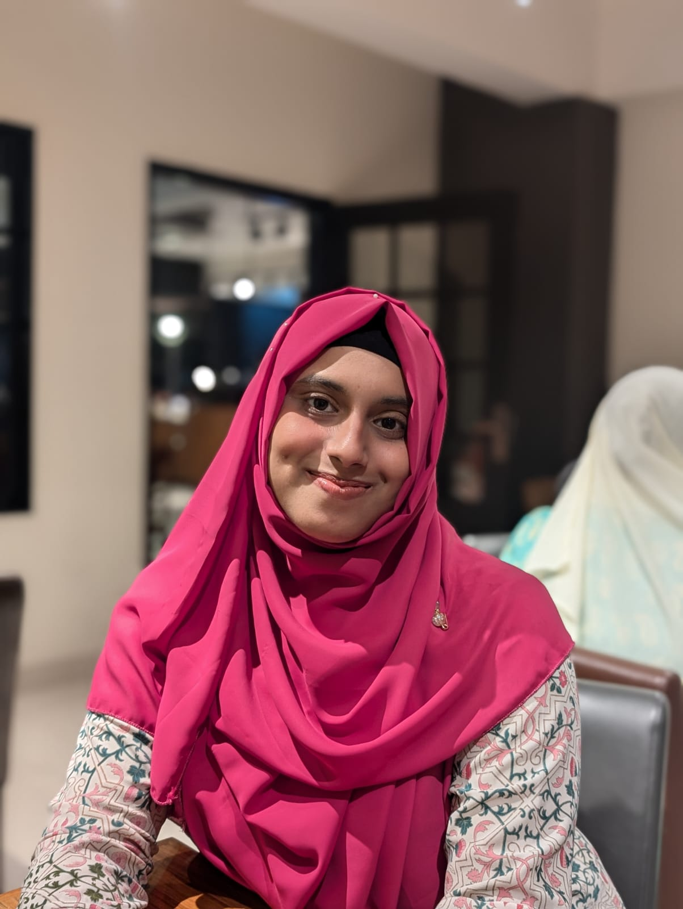

## Profile Picture

## Education

- **Bachelor of Science in Computer Science and Engineering**
  - **Institution**: Jahangirnagar University
  - **Duration**: 2022 - 2026
  - **Grade**: 3.75

- **HSC**
  - **Institution**: Feni Girls' Cadet College
  - **Duration**: 2018 - 2020
  - **Grade**: GPA-5

- **SSC**
  - **Institution**: Feni Girls' Cadet College
  - **Duration**: 2016 - 2018
  - **Grade**: GPA-5

## Experience

### Executive Member ( Batch Representative )
- **Company**: Ex Cadets Association of Feni
- **Duration**: June 2021 - Current
- **Responsibilities**:
  - HR and planing and managing events.
  - Designing Banner, Poster, Invitation-Cards, T-shirts.

## Skills

- **Programming Languages**: Python, Java, C++, PHP, C, HTML, JS, CSS
- **Database**: MySQL
- **Frameworks/Technologies**:  React, Node.js
- **Tools**: Git, XAMPP
- **Graphics Design**: Adobe Illustrator, Adobe Photoshop

## Languages

- **English**: Fluent
- **Bangla**: Native

## Extracurricular Activities

- **Volunteer**: Organized National Collegiate Programming Contest.
- **Volunteer**: Organized Ex-CAF Reunion 2018
- **Volunteer**: Participated FGCC Environment Restore Programming 2019
- **Volunteer**: Organized Ex-CAF Iftar 2022
- **Volunteer**: Organized Ex-CAF Iftar 2023
- **Volunteer**: Organized Ex-CAF Iftar 2024
- **Club Membership**: JU Programming Club.
- **Club Membership**: IOT & Robotics Edge, IIT, JU.
- **FGCC MUN**: Delegate of India
- **Math Olympiad**: Participant
- **Bangla Extempore**:  Inter House Bangla Extempore Speaker
- **Inter House Athletics Competition**:  100 meter sprint, 200 meter sprint, shotput throw, 100 meter relay (4 x 100), 400 meter relay (4 x 400)  
- **Inter House Basketball Competition**: Runners Up- 2016,2017
- **Inter House Handball Competition**: Champion-2017

## Awards and Certifications

- **Certifications**: 
  - Basic Designer of IOT & Robotics 
  - Basic Designer of Graphics (AI, PS) 
  - Resposive WebDesign freeCodeCamp

- **Awards**:
  - Champion in Bangla Essay
  - Runners Up in Bangla Extempore

## Contact Information

- **GitHub**: [github.com/username](https://github.com/XtremeseOISHEE)
- **LinkedIn**: [linkedin.com/in/username](https://www.linkedin.com/in/asmaul-husna-oishee-57714a229/)
- **Email**: asmaul4husna94oishee@gmail.com
- **Codeforces**: [codeforces.com/profile/username](https://codeforces.com/profile/kuru_loli)
- **Twitter**: [@username]( https://x.com/amber_94_oishee?t=dn-6cEqeDT4Zg7vERkkh2Q&s=07)
- **Instagram**: [@username](https://www.instagram.com/clementine_494/)

